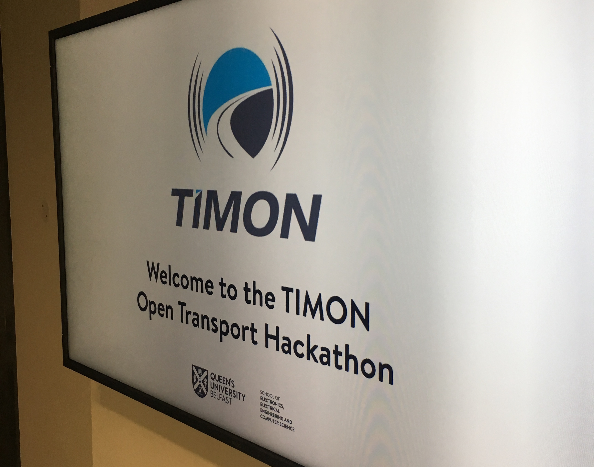
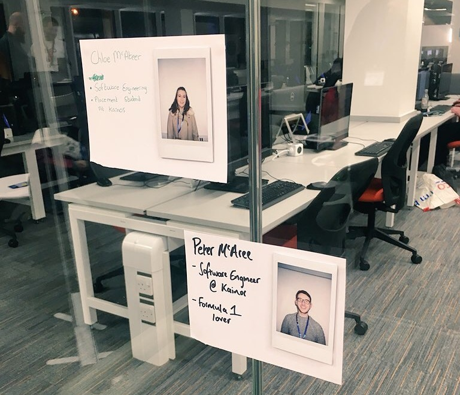
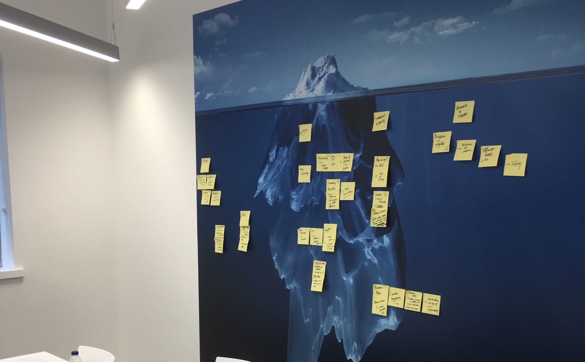
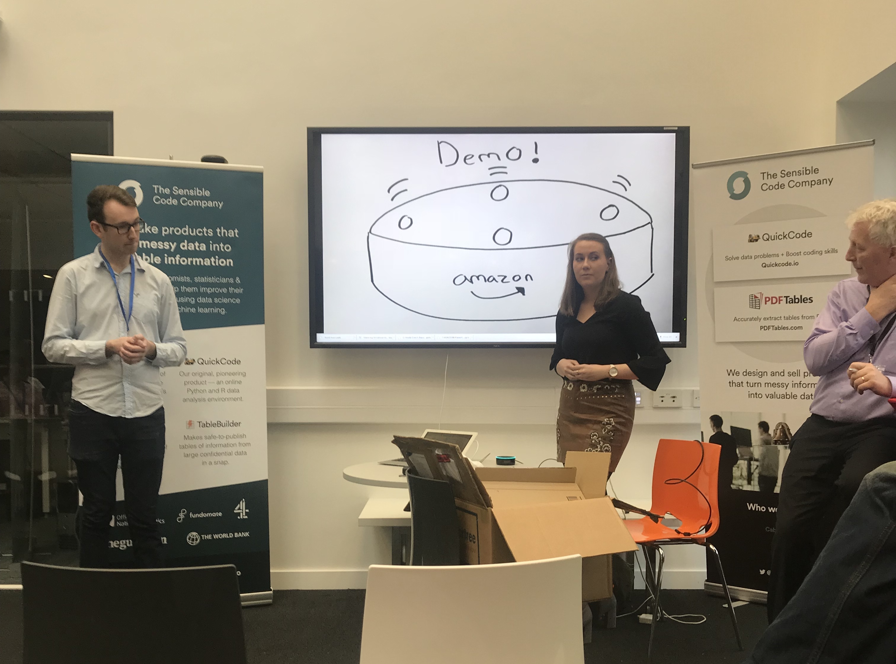

Last weekend, [Chloe][chloe-twitter] and I attended the TIMON hackathon held in QUB’s computer science building. Focusing on transport and open data, TIMON is a EU funded, H2020 project which has 3 main goals:
* Reduce pollution
* Reduce congestion
* Increase safety of road users

Starting 3 years ago with a whopping £5.6m budget, they focused on five key areas which attempted to benefit numerous road users. Now, as this is an **EU project**, they had to outline what they were going to use that budget for up front - with very little change once it was set.

However, they did allocate a small proportion of the budget to ‘other findings & research’ - enter the idea of a **hackathon**.

## Registration

Friday evening came around, we registered and listened to the introduction about the project. They explained some of the data that was made available to us via the REST API that they had developed. 

We grabbed a beer and started chatting to some of the TIMON guys - to see if we could get any little gem out of them, but unfortunately they were pretty resilient!

And so, the brainstorming began. We knew we wanted to try something neither of us had worked with before, a new technology that was going to provide real value to users. We generated some ideas that could potentially have worked but quickly killed them off and moved on.

Finally, we settled on home automation as our tech and we had easy access to Amazon’s platform - **Alexa**.

One of the other objectives of the project was to provide better and more efficient route planning. We explored the API docs to see what we could utilise. We found reports of national accidents and roadworks which were updated in real-time. Both of these provided details including the latitude and longitude, type of incident and start time - *this peaked our interest!*

We wanted to keep the PoC as lightweight as possible given the typical time constraints of a hackathon, so we fleshed out the idea as much as possible thinking about the future and the potential of combining the API with Alexa.

## Flash Commute ⚡️

Since neither of us had actually developed a skill for Alexa before, we needed to get reading some documentation. We discovered there were a couple of key things about Alexa skills:

* Skills used AWS Lambda to power them - serverless functions that the skill hits whenever it is invoked (which was mainly just a buzzword to us at this point)
* Skills can be developed in a range of different environments, including Java, C# and Node.js

Now, both of us being mainly JavaScript developers, **Node.js** was music to our ears. We knew how to quickly get that up and running, hook the http library in and get cracking with the API. 

What we didn't foresee was the dependency tree between the Alexa Skill Kit (ASK), AWS CLI, Amazon developer account, AWS account and, as you can imagine, the list goes on.

Now at this point, half the day was gone, we were still no further to getting a skill deployed and we hadn't really thought about the pitch (which was at 2pm the next day - still plenty of time, right?). We decided it would be best if one of us focused on the skill and the other on the pitch. 


A few hours later, we had some of the pitch done but more importantly, we were ready to test the skill on the echo dot itself. We had managed to get it deployed, hooked the dot up to the wifi (which ended up being one of our iPhone's hotspots!) and enabled the skill on the device

`"Alexa, open flash commute"`

 to which her response was 
 
 `"Sorry, I can't seem to find that skill."` 
 
 *Brilliant.*

After many painful restarts of the echo dot, enabling & disabling the skill, we finally found that the skill had defaulted the language to "English (USA)" and of course, our dot was in the UK region. 

We gave it one last test, the skill opened and we were delighted to hear Alexa grace us with her voice:

`"Welcome to Flash Commute, what would you like to know?"`

Tired, drained and crashing from the caffeine, we decided to call it a night and get some rest.

## Jill’s typical commute

Up early, we were fresh and ready to go. We had a game plan in mind for finishing and polishing the pitch as well as quickly adding what we could to the AWS function to give us some sort of demo. Pitches were at 2pm so that gave us just enough time to get a couple of run throughs before the final deadline.

Our idea focused around the **accessibility of home automation and getting a quick update about your regular commute**, in a flash - hence *Flash commute!* The user would enter their regular destination in the Alexa app along with assigning it a keyword e.g. ‘work’. 

Pulling the accidents and roadworks data down from the API, we cross-referenced the route with the coordinates of any incident reports to check if there were any issues - alerting the user if there were any. This quickly gave the user enough information to assess whether they should take another route or continue along their usual one.

2pm arrived, we were as prepared as we could be. Armed with a story about Jill and an echo dot connected to 3G - we headed to the pitches. 

Presenting towards the end, we told the story about Jill who was our typical commuter, gave a live demo (which actually worked on 3G!) and talked about our potential plans for the future.

The pitch went smoothly. The judges conferred and made their decision - we were delighted to find out that we had managed to scoop the **Best use of TIMON** prize! 

## Summary

Overall, the whole weekend was great fun! We managed to hack together something that neither of us had any experience of before and walked away with a prize too! 

Key takeaways:
* Generating numerous initial ideas, we were able to objectively kill the non-viable ones **quickly and effectively**
* **AWS Lambda** - developing out a PoC that we got functionally working on an Echo Dot device whilst learning a tonne about how skills hang together
* Not losing the hackathon ethos - **just having plain, old fun!**

Congrats to Mary-Jane (also from Kainos) and her team on winning the overall prize! Great idea and use of new, innovative technology.

Finally, big thanks to the [Sensible Code][sensible-code] guys for curating the hack as well as the TIMON representatives for providing us with the data via the API which we used as well as the awesome prizes provided too! 

*Read more about the [TIMON project here][timon-project].*

[chloe-twitter]: https://twitter.com/ChloeMcAteer3
[sensible-code]: http://sensiblecode.io/
[timon-project]: https://www.timon-project.eu/
