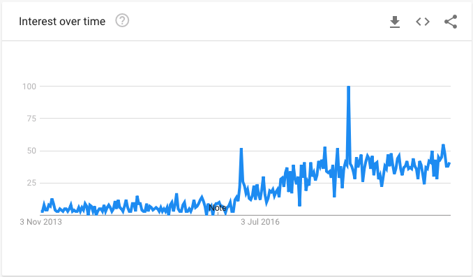

So I recently spoke at BelfastJS - a local meetup that focuses around, well, JavaScript. Over the past number of months, I've attended various hackathons, meetups and other events mostly making use of my JavaScript skills along the way.

One particular area of interest that caught my attention from attending these events is chatbots. As it turns out, chatbots and JavaScript go hand in hand, so that was my topic of choice!

Having built a few chatbots, I wanted to share my thoughts on why I believe they are incredibly powerful and how they can really help to automate a lot of manual tasks - it just requires a mind shift from the humans.

A chatbot is a service that facilitates a natural conversation between itself and a human, consuming instructions along the way.

## The good, the bad and the.. pretty ugly

Chatbots aren't a totally new concept - they've existed ever since the creation of the concept of Artificial Intelligence. However in saying that, they've came a long way since they were initially invented. It's only really been in recent years that we've really started taking them seriously.

The photo above shows the Google Trend for the term *chatbots* over the past 5 years. It stayed fairly steady up until around 2016 and has been on the rise ever since.

As I did some more research, I had came across the reasoning for this spike:
- Facebook had announced some stuff about conversational UI @ F8
- Google had announced Google Home and some updates around Google Assistant
- But most importantly, Microsoft had released their Twitter **Tay bot**

Tay was a Twitter bot that utilised AI (specifically natural language processing) in an attempt to mimic the language patterns of a 19 year old, American girl. The cognitive model in behind the scenes was trained by general public direct messaging the bot about different trends and topics.

Needless to say, this was abused by a minority and Tay quickly turned into a nasty piece of work. **96k tweets and 16 hours into production**, Microsoft had to remove her from Twitter because the bot had begun to respond to users with racist tweets along with various Nazi propaganda - not good.

The whole scenario got out of hand very quickly and does raise an important question around the ethics of AI and chatbots - but that's for another time.

## Chatbots come in all shapes and sizes

Modern day use cases for chatbots really do vary. They can range from simple QnA chatbots that pull from a knowledge base right to chatbot lawyers that can actually appeal your parking tickets and more!

-- photo of DNP? --

One of the most important characteristics of chatbots is that they are adaptive and versatile. No matter what industry you are in or who your target audience is - nine times out of ten, a chatbot can fit right into your solution.

Whether you are wishing to engage more users with your service or automate an existing process, a chatbot can be as simple or as complex as you make it.

## Summary

-----

*Sub-section with some more information will go in here!*
