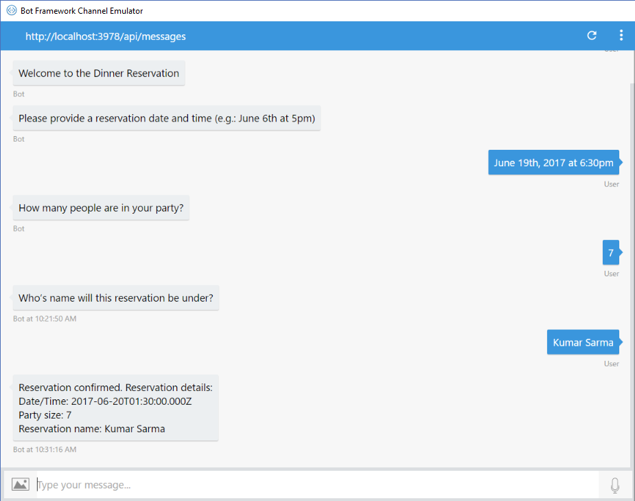
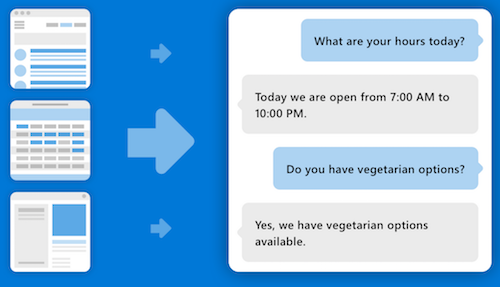
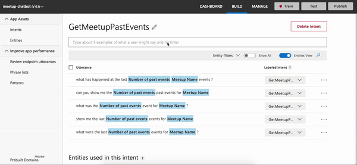

Following on from my [previous blog](https://petermcaree.com/unlocking-the-power-of-chatbots/), I thought it was time to give a quick introduction to getting started with chatbots - on a bit more of the technical side of things.

As I noted in the previous blog, I have mainly been working with Microsoft’s Bot Framework SDK. It has an offering for both C# and JavaScript (specifically Node.js). With me being an UI engineer, I love all things JavaScript - so I’ve been working with the Node offering.

## Trusty Libraries 📚

When getting started with developing chatbots, they have some minimal requirements:

- [Node.js](https://nodejs.org/) (& npm)
- [Bot Framework Emulator](https://github.com/Microsoft/BotFramework-Emulator)

Pretty standard when it comes to modern JavaScript development! One of the many things why it’s so great.

On a very basic level, **chatbots are a simple web service that the user can interact with**. So the first port of call is to install one of our favourite web service libraries - something like Express or Restify will do the job:

```bash
$ npm install —-save express
```

Basic chatbots only require one endpoint (POST) to be registered on the web service, to listen for any incoming messages from the user. This makes it really easy to understand the flow through the logic of the chatbot - with there only being one entry point into the application, it makes debugging easy. Create your entry point to the Node service, `index.js`.

Require in Express (or Restify) and setup the simple HTTP service whilst registering your POST endpoint:

```javascript
const express = require('express');

const app = express();

// Listen for incoming messages.
app.post('/api/messages', (req, res) => {

});

app.listen(3978, () => console.log('Listening on 3978.'));
```

Most of this should look fairly familiar, another reason why chatbot development is so great!

## Introducing BotBuilder 🤖

With Microsoft's recent(ish) release of v4 of their [BotBuilder SDK](https://docs.microsoft.com/en-us/azure/bot-service/?view=azure-bot-service-4.0), it comes with a handful of great improvements that makes development a lot easier. It wraps up a lot of the adapter and configuration code inside ES6 classes - which simplifies a good bit of the initial setup.

Before diving into some code snippets, it's worthwhile going through some of the different types of interactions that the user can have with a chatbot.

#### Dialogs

Very basic bots can be used to capture basic information about a user through a series of questions before finally processing the input and providing some insight back to the user.

These types of bots are typically used for streamlining and enhancing the UX around capturing basic information - like the example below for capturing reservation details:



Within these dialogs, there are a number of different prompts that you can utilise to enhance the UX and simlifying their flow for data entry. Once the user has responded to 

BotBuilder makes this super simple to achieve. It nicely wraps the functionality up in some different classes that we can utilise when building our bot - check out [this sample bot](https://github.com/Microsoft/BotBuilder-Samples/tree/master/samples/javascript_nodejs/05.multi-turn-prompt) for more details.

#### Question and Answer

Slightly more advanced, the QnA bot is the first light touch on the artificial intelligence side of chatbots. Aim is to provide automated and accurate support for frequently answered questions that do not require any specialist knowledge or help.

Developers can interact with the specific cognitive service that Microsoft have created - [QnA Maker](https://www.qnamaker.ai/). This makes it super easy for people to create and train their QnA service that can satisfy a lot of use cases for people.



It offloads the conditional logic in behind the scenes and means developers only really interact with (yep, you guessed it) their nicely wrapped up classes of the BotBuilder SDK.

#### Natural Language Processing

Whilst the QnA chatbot has an element of NLP built in, as a developer, you don't have total control over the model, expectations and outcomes. For those that require bespoke logic, Microsoft have created [Language Understanding Intelligence Service](https://luis.ai/) (LUIS) which allows developers who aren't machine learning experts to implement a fairly complex model that will satisfy a lot of their needs.

LUIS being a cognitive serivce means that it is super simple to implement into any application, not just chatbots. The cognitive model can be manually trained via the straightforward web application (below) or a pre-existing JSON model.



When implementing the LUIS model, there are three concepts that you need to understand prior to developing it:

* **Utterances** - the sentence that the user says/types
* **Entities** - the noun(s) the user is referencing e.g. object, place
* **Intent** - the action the user wants the bot to perform

The main difference between QnA Maker and LUIS (apart from the granularity control) is how the response from the API is consumed by the developer.

With QnA Maker, there is no real handling from the developer perspective, the result that comes back from the API is what should be sent back directly to the user.

Whereas with LUIS, the response from the API is a combination of prediction score, intent and some extra metadata. The developer must then handle this API response and react according before responding to the user - this allows the freedom to add in some more complex logic rather than just a simple message response.

## Show me the ~~money~~ code 💸

Ok, back to some code snippets - how do we hook this elusive BotBuilder library into our simple Node web service?

I'm going to focus on a basic use case that utilises LUIS and handles the response accordingly.

#### Node endpoint ft. adapter

Firstly, the BotBuilder SDK has abstracted it's functionality into a few separate packages to ensure that the developer is only bundling what it requires into their own application. We're going to require in it's base library along with the AI library too:

```bash
$ npm install --save botbuilder botbuilder-ai
```

Require in the `BotFrameworkAdapter` class from the base BotBuilder library and create a new instance of it. Something like the following:

```javascript
const { BotFrameworkAdapter } = require('botbuilder');

// Create adapter to facilitate communication
const adapter = new BotFrameworkAdapter({
    appId: process.env.MicrosoftAppId,
    appPassword: process.env.MicrosoftAppPassword
});

// Listen for incoming requests.
app.post('/api/messages', (req, res) => {
    adapter.processActivity(req, res, async(turnContext) => {
        // TODO: Include bot handler
    });
});
```

We're basically initializing our adapter with some credentials (these come from registering your bot with the [Azure Bot Service](https://azure.microsoft.com/en-gb/services/bot-service/)), however these aren't required for local development so they can be left blank. The adapter facilitates communication and authentcation between the bot and the user.

All messages are routed through `processActivity` handler, this is essentially the entrypoint into the bot. It then has an async callback function that passes in the turnContext, which is where the user message (amongst other information) is contained.

#### Bot Logic

Finally, we just need to create our custom class for our bot logic. For this particular LUIS bot, we're going to require in the `botbuilder-ai` library and make use of some of it's functions:

```javascript
const { LuisRecognizer } = require('botbuilder-ai');

class LuisBot {
    constructor(application, luisPredictionOptions) {
        this.luisRecognizer = new LuisRecognizer(application, luisPredicationOptions);
    }

    async onTurn(turnContext) {
        // TODO: Some conditional logic
    }
}
```

Since we're interacting with a Microsoft cognitive service, they have a class that nicely wraps up all of the LUIS functionality we'll need. We simply call the constructor, passing in some configuration - which includes application ID and secret key (can be accessed upon registration of your [LUIS](https://www.luis.ai/) application).

We define the async `onTurn` function which facilitates the request to the LUIS API and the conditional logic for what to do with the response:

```javascript
async onTurn(turnContext) {
    // Make API call to LUIS with turnContext (containing user message)
    const results = await this.luisRecognizer.recognize(turnContext);

    // Extract top intent from results
    const topIntent = results.luisResult.topScoringIntent;

    switch (topIntent.intent) {
        case 'Greeting':
            await turnContext.sendActivity('Hey! Ask me something to get started.');
            break;
        case 'UpdateInfo':
            await updateInfoIntent.handleIntent(turnContext);
            break;
    }
}
```

Remember the `turnContext` object that is passed into the callback function in our endpoint entrypoint? Well, now you can fully see it's usage above. Firstly, we pass it into the `luisRecognizer.recognize` function which comes back with the LUIS API response.

Once we have our response, we can switch over the different intents we've defined in the LUIS web application and handle them appropriately.

Critically, whenever we're ready to send a response back to the user, we use the `turnContext` object again, via the `sendActivity` function it contains.

#### Plug together

The final piece to the puzzle is to create an instance of our bot class inside our Node entrypoint so that we can invoke the `onTurn` function whenever the endpoint is hit:

```javascript
const bot = new LuisBot(luisApplication, luisPredictionOptions);

// Listen for incoming requests.
app.post('/api/messages', (req, res) => {
    adapter.processActivity(req, res, async(turnContext) => {
        await bot.onTurn(turnContext);
    });
});
```

And that's it! At a very basic level, these are the main components that you need to utilise to create a chatbot that interacts with LUIS.

## Summary

Overall, intelligent chatbots are super simple to get up and running using Microsoft's BotBuilder SDK and Node.js.

* I'm using Microsoft's offering for their cognitive services - AWS, GCP amongst other cloud providers will also offer similar services that you can also integrate with.
* Cognitive services can really increase the power of your chatbot and what it can do for your indiviual use cases.
* Use the resources available! There is an abundance of services, tutorials and frameworks out there - use them!

I've included some of the resources in this [gist](https://gist.github.com/pmc-a/740a39d327e31faeca2a206c5183012e) which I'll update from time-to-time!

---

##### Image credits:

* [Photo by Shane Rounce on Unsplash](https://unsplash.com/photos/PHKgQSGzwpw)
* [Bot Framework - Waterfall dialogs](https://docs.microsoft.com/en-us/azure/bot-service/media/bot-builder-nodejs-dialog-manage-conversation/waterfall-results.png?view=azure-bot-service-3.0)
* [QnA Maker - Icon](https://www.qnamaker.ai/)

