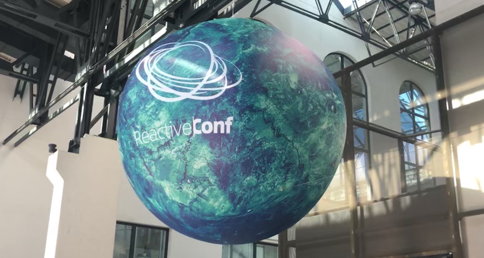

Last week, I had the pleasure of attending @ReactiveConf in Prague - a three day event focusing on bleeding-edge web technologies and their usage. Passionate and inspiring people in tech came from every corner of the Earth to attend, share their stories and spark conversation about the present and the future.

With a packed schedule and two main tracks, I was first tasked with making difficult decisions on which talks to attend for each slot! Themes were varied throughout the event, but the more prominent ones included GraphQL, security, web assembly and testing.

The conference venue itself was amazing, located just on the outskirts of the city centre, it comfortably coped with the ~1500 people that were in attendance. Talks were spread across two different stages, with plenty of caffeine in between to keep everyone fuelled up.

— insert photo of stage —

All of the talks that I had managed to attend were brilliant, but the following 5 were standouts for me personally - I’ve written a quick overview and some of the key takeaways that I think are relevant:

## Cypress.io - the state of the art end-to-end testing tool (Gleb Bahmutov)
Gleb introduced his talk as a way to implement testing, without it being frustrating and providing _true_ value to your application, rather than just another checkbox.

“Testing is like scaffolding, it doesn’t provide the features and value for users, but it’s necessary for the construction of your application”.

Stop talking about the testing pyramid. If you are writing code, you should test it - it doesn’t matter which type of test you write, as long as the test provides you with the confidence that your code works.

Gleb proceeds to give different examples of what Cypress can do and the power of it, but encourages developers to take a step back and truly understand what they want the outcome of their testing to be. Ask yourself: what should I test?

100% code coverage doesn’t always guarantee zero bugs in your code. “Use code coverage as a tool for creating the right tests, not a target to hit” - it’s the delta in code coverage that matters, not the actual number itself.

We shouldn’t be afraid of writing long tests - users might take long flows through your applications, so why not replicate this in our E2E tests? But we should always find the balance - utilise checkpoints in Cypress.

### Key takeaway
Write the tests that make sense for you, use code coverage as a tool to write your tests, not as the goal.

---

## Rethinking Design Practices (Mark Dalgleish)

Mark opened with a bold statement that he wanted to rethink design practices - focusing on how our design tools integrate with technology.

He floats the idea that our industry is at a crossroads, we can either code in design tools (e.g. sketch) or we can design in code. Focusing on designing in code, he portrays the major advantage of developers and designs speaking the same language.

OSS design systems -> Braid (by Seek)

Plugs Playroom and suggests that JSX is the design tool - easy medium to allow designers to play around and prototype? Shareable URLs, quick feedback loop etc.

Components shouldn’t have whitespace around them - in terms of a design system, layout components should be the things controlling the whitespace around them. People accept this rule but the browser does not, it will add padding and spacing around elements.

If we want to be able to design in code, we need to pay attention to how designers iterate.

### Key takeaway:
Mirroring our design systems to the designers mental model is critical to success when it comes to design systems.

---

### Mind-reading with Intelligent & Adaptive UIs (David Khourshid)

David introduced his talk by highlighting that user flows are seldom linear, and that our users will use our applications in different ways.

Adaptive UIs is one possibility of how to handle this - catering for not only different devices, but also different users - but there is a lot that needs to be taken into account.

Based on analytics, we could potentially prefetch different bundles that will render the next stage in the users flow, prior to them actually navigating to it (via Guess.js).

He portrays the idea of using finite state machines as a way to think about UIs and construct them - thinking of how the users flow through application and what state they have.

Utilise weighted graphs in order to highlight the importance of the different flows.

Almost once a threshold is hit of how frequently a user chooses a path, we can adapt to that and redirect to something else.

### Key takeaway
Users use our applications in different ways, so why don’t we try and learn from this - specifically allow the application to learn and adapt based on the data we have on our users.

---

### Kicking Bugs and Logging Names: Errors in JavaScript Error Reporting (Liz Krane)

Liz opened by giving an awesome history of how JavaScript has evolved, ultimately into something that it probably wasn’t initially intended for.

Honing in specifically on debugging and error handling, Liz showcased the many, many problems that JavaScript has produced over the years.

However, we have adapted our tools and skillsets that allow us to actually capture these issues and importantly, debug them.

Liz proceeded to showcase Sentry.io - an open source tool for tracking and monitoring errors, and in this case specifically for modern web applications.

### Key Takeaway:
We can’t rely on users reporting the errors, we need to actively track the errors that they face on a daily basis, to provide a more robust outlook on our applications - giving us motivation and statistics in order to address these.

---

### Don’t Believe the Rumors: Writing tests for CSS is Possible (Gil Tayar)

Gil delivered a somewhat, light-hearted fun and engaging talk but with a real focus and purpose.

We as developers, test our functional logic - backend and frontend, we craft unit tests to provide us with confidence that our logic works as expected e.g. when a function is called, it updates state in a particular way.

But do we test the visual aspect of our applications? Not just UI testing, because we usually assert that a user can input text into the input field, right?

How do we actually test the _CSS_ of our application?

Gil proceeded to showcase one of the tools that his company (**INSERT COMPANY NAME AND TOOL NAME** ) work on, that provides functionality to perform visual regression testing.

It’s a hard one to crack because currently, we always need a human to say whether something was intentional or not, unless we go with a percentage based approach - which wouldn’t provide as much confidence.

For example: if the colour of our navigation bar changed from white to grey, was that intentional or a mistakenly updated global variable? Without some form of human input there, we wouldn’t be able to tell for certain or not.

Gil’s product provides a combination of pixel by pixel comparison and evaluating for updates, but provides a sleek UI that allows the human to quickly accept or reject changes, providing that confidence in the UI regression.

### Key takeaway:
Visual regression testing isn’t considered or implemented enough, and it should form part of our process to ensure consistency across platforms - definitely food for thought!

---

## Conclusion

Luckily, all of the talks are available on YouTube as they were live streamed by the conference organisers - which went incredibly smoothly! So they are available for everyone to tune in, which I would highly recommend!

On top of the talks, I had the opportunity to speak to some of the speakers themselves and get a general vibe for where they think the future of web development lies - everything from the power WASM is potentially going to have to remotely jumping onto a VS code  instance online and fixing a production issue.

Overall, the whole conference was great - not only extremely thought provoking about the current approach to problems we face in todays web development ecosystem, but also about the future: how we’re going to have to adapt, how users are going to continue to demand more performance from the applications we produce and ultimately how we can make a better experience both for users and developers!

**Embed Twitter moment too**
